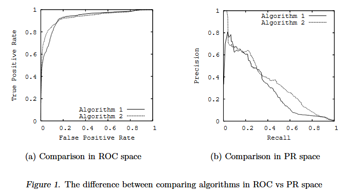

## Module 4: Evaluating Recommender Systems

1. For each of the following metrics, provide a business justification as to why you would use this metric to evaluate your model?

RMSE: RMSE is a type of measurement for accuracy.  With robust historical data and under the assumption that the data is unbiased (i.e., that users' behavior will continue to be similar in the future even with the presence of the recommender system), RMSE is a simple and easily computable metric for measuring the overall accuracy of a recommender system.  Since it's used in a variety of other statistical and ML areas, it's also widely understood and interpretable (a benefit for a variety of stakeholders).  It's also useful for times when accurately predicting low ratings is also important (since it measures overall error rate, not just error rate for highly-ranked items).

Precision@K and Recall@K: As discussed in more detail below, these two measures help to quantify two important dimensions of a recommendation engine, especially in the context of quantifying the degree to which a system places helpful recommendations in the high up in a list when the number of recommendations is limited. Often precision or recall will be more important than another in a particular use case and thus one metric will be better used for evaluation purposes.

AUC (Area under the ROC curve): The AUC metric combines into a single measure recall (often called True Positivity Rate, or sensitivity) and False Positive Rate (see Figure 1). An ideal ROC curve should be pushed into the upper-left corner so that the total area under the curve is close to 1. This is a good measure that combines these two dimensions, though it does not consider the order/position rankings of recommended results (as does precision@K and recall@K) nor the specific ratings that are given (relevance is thus only binary).  In addition to AUC, one could also consider looking at area under the precision-recall plot, which similar to AUC, is ideally close to 1 (though the curve should be pushed into the upper right corner).  Figure 1 shows that these two metrics can give two different assessments.  Combining the two metrics to assess overall coverage would be useful.

nDCG: This is the normalized version of the Discounted Cumulative Gain (DCG) metric, normalized so that it can be compared to other recommender systems (Falk 2019, 228-29). DCG explicitly takes into account the rank or position ordering of the list of recommended items by penalizing items lower on the list (since we assume again that results higher on recommended list will be more useful to the user). The metric can also account either for generic, binary relevance or for relevance that is based on an ordinal or ratio scale, a fact that makes it even more useful when relevance is not binary. For businesses that are using a recommender system to recommend products and items on a webpage with limited space or where user attention is limited, nDCG can be a good choice for assessing the effectiveness of a system.

MAP (Mean Average Precision): This metric averages out Precision@K over all values of K, from 1 to K. Like nDCG, it thus takes into account order/position ranking of the recommended results. This metric would be better suited when precision is emphasized (i.e., making sure that relevant items occur high in the recommendation list). 

Ultimately, the best choice of metric for a recommender system should consider the precise business use case. Moreover, none of these metrics explicitly takes into account other important aspects of a recommender engine like novelty and variety. These should also be carefully included into any evaluation strategy.

 (David and Goadrich 2006, Figure 1)

1. Expand on why Precision@K and Recall@K must be analyzed together for a balanced view and their relationship to each other in a recommender systems model.

Precision measures the proportion of relevant recommended items to total items recommended, while recall (also called sensitivity) measures the proportion of recommended items to all relevant items (Falk 2019, 226-227). Precision is a measure related to accuracy (i.e., how well did the system do in recommending items that the user finds relevant), while recall is a measure related to coverage of (i.e., how much of total relevant content were recommended). As proportions, both metrics exist on [0,1].

If a recommender engine is allowed to provide an unlimited number of recommendations, then recall can be made 1 simply by recommending all items (Manning et al 2008). But of course, this would not not be a useful system. Recommender systems often return only a very limited number of recommendations due to UI design choices or to users not willing or able to look through a large number of recommendations (e.g., a top 10 list rather than a Google search results). 

As a result, it is also important to consider not simply whether a recommender system returned helpful recommendations or recommendations that cover the items well, but also the degree to which it does both of these high up on the rank/position ordering of the list of recommended items, which both of these metrics can do. They should also be analyzed in tandem, since many use cases of recommender systems often need to have some balance of the two.  As I wrote in a discussion post, for most business settings, precision is more important, but for academics engaging with a research database, recall might be more important, since academics are often more concerned with breadth and coverage (and with a larger K).  But in both uses cases, the other metric also matters and makes for a better system.

### References
* Davis, Jesse, and Mark Goadrich. 2006. “The Relationship between Precision-Recall and ROC Curves.” In Proceedings of the 23rd International Conference on Machine Learning  - ICML ’06, 233–40. Pittsburgh, Pennsylvania: ACM Press. https://doi.org/10.1145/1143844.1143874.
* Falk, Kim. 2019. Practical Recommender Systems. Shelter Island, NY: Manning.
* Manning, Christopher D., Prabhakar Raghavan, and Hinrich Schütze. 2008. Introduction to Information Retrieval. Cambridge: Cambridge University Press.